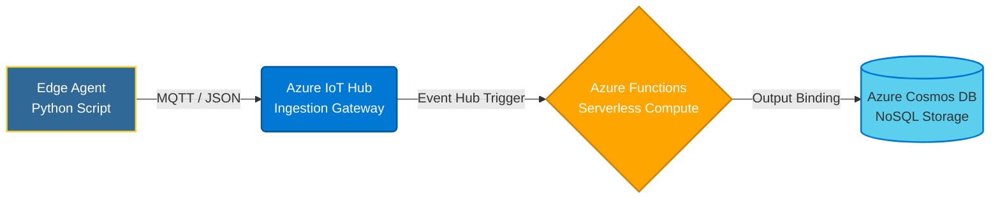

# Cloud Telemetry Pipeline: Edge to Serverless


## Descripción del Proyecto
Este proyecto es una prueba de concepto (PoC) de una arquitectura de telemetría *End-to-End* (de extremo a extremo). Simula un agente perimetral (Edge Agent) incrustado en un router que recopila métricas de red y las transmite de forma segura a la nube en tiempo real. Una vez en la nube, una arquitectura Serverless procesa el flujo de datos, evalúa reglas de negocio (alertas de latencia) y almacena el histórico en una base de datos NoSQL para su posterior análisis.

Este sistema fue diseñado priorizando la escalabilidad, el bajo acoplamiento (separando la lógica del dispositivo de la lógica de la nube) y la optimización de costos utilizando recursos *Serverless*.

## Arquitectura del Sistema

El flujo de datos sigue el siguiente modelo:



1. **Edge (CloudTelemetry-Agent):** Un script en Python genera telemetría simulada (CPU, latencia, pérdida de paquetes) y la transmite de forma segura usando el SDK de Azure IoT.
2. **Ingesta (Azure IoT Hub):** Actúa como la puerta de enlace bidireccional en la nube, autenticando el dispositivo y recibiendo millones de eventos con alta disponibilidad.
3. **Procesamiento (Azure Functions - V2 Model):** Una función Serverless en Python se dispara automáticamente en tiempo real con cada mensaje entrante. Extrae el JSON, inyecta UUIDs, y lanza advertencias en los registros (*logs*) si la latencia de la red supera los 100ms.
4. **Almacenamiento (Azure Cosmos DB):** Base de datos NoSQL que guarda los documentos JSON procesados de forma permanente, agrupados mediante *Partition Keys* por `device_id` para optimizar consultas futuras.

## Estructura del Repositorio

El proyecto está dividido en dos espacios de trabajo independientes para emular un entorno real:

```text
📦 CloudTelemetry-Project
 ┣ 📂 CloudTelemetry-Agent         # Código que se ejecuta en el dispositivo físico (Router)
 ┃ ┣ 📜 data.py                    # Generador y transmisor MQTT
 ┃ ┣ 📜 .env                       # (Ignorado por Git) Credenciales del dispositivo
 ┃ ┗ 📜 .gitignore
 ┗ 📂 CloudTelemetry-Function      # Código que reside en los servidores de Microsoft Azure
   ┣ 📜 function_app.py            # Lógica principal del Serverless y Output Bindings
   ┣ 📜 local.settings.json        # (Ignorado por Git) Cadenas de conexión a la nube
   ┣ 📜 requirements.txt           # Dependencias de Python (azure-functions)
   ┗ 📜 host.json                  # Configuración del motor de Azure Functions
```

## Requisitos Previos y Ejecución Local

Para ejecutar y depurar este proyecto localmente, se requiere:
* Python 3.x
* Paquetes de Python: `azure-iot-device`, `python-dotenv`, `azure-functions`
* Herramientas locales: **Azure Functions Core Tools v4** y **Azurite** (Emulador de almacenamiento).
* Infraestructura en Azure: Instancias activas de IoT Hub y Cosmos DB for NoSQL.

## Autor
**Carlos Adolfo Pérez Luna** | Estudiante de Ingeniería en Telemática | UPIITA - IPN  